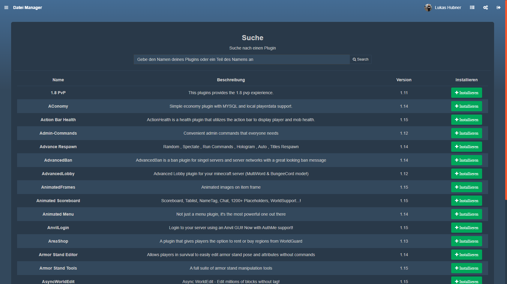

Hier erfährst du, wie du Plugins auf deinem Minecraftserver installierst.

## Information
Plugins sind Erweiterungen für deinen Minecraft Server um das Spielerlebnis zu vervielfältigen. Bitte gehe sicher, dass du zuvor [Spigot auf deinem Server installiert](minecraft-gameserver-spigot-installieren) hast.

### 🐧 DeinServerHost PluginManager

Im unserem Gameserverpanel kannst du Plugins mit nur einem Klick installieren lassen.

1. Klicke hierfür in der Sidebar auf den Punkt `Plugins`

2. Dir wird nun eine Auswahl an Plugins für Spigot vorgeschlagen. Über die Suchfunktion kannst du dir dein Wunschplugin heraussuchen.
    
    
    
    > [!] Achte vor der Installation auf die angezeigte Version und ob das Plugin mit deiner Spigot Version kompatibel ist

3. Klicke bei deinem Wunschplugin auf `Installieren`

✔ Das Plugin wird automatisch installiert und ist nach einem Serverneustart aktiv
                                                                                                                                         
### 💾 Externe Plugins installieren

Sollte dein Wunschplugin nicht in der Liste sein, kannst du dir dieses einfach von beispielsweise spigotmc.org herunterladen und manuell auf deinen Server hochladen.

1. Öffne hierfür den Dateibrowser

2. Navigiere in den Ordner Plugins

3. Ziehe das heruntergeladene Plugin in den Dateibrowser

    > [!] Warte, bis der Uploadbalken grün wird

✔ Dein Plugin wurde hochgeladen und ist nach einem Serverneustart aktiv