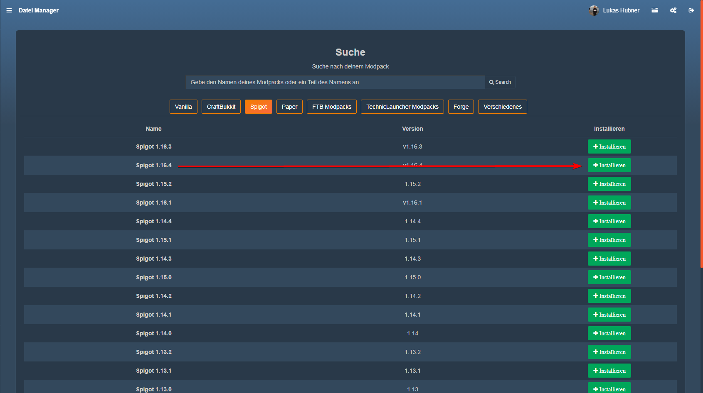

Hier erfährst du, wie du deinen Server für Plugins vorbereitest.

## Information
Die Serversoftware Spigot ersetzt den Standard Minecraft Vanilla Gameserver und schafft die Möglichkeit, Plugins zur Spielerweiterung auf deinem Server zu installieren.

### 💻 Installation

1. Klicke im Gameserverpanel auf Versions / Mods. Wie du dich dort anmelden kannst, [erfährst du hier](gameserver#-gameserver-panel).

2. Klicke in der oberen Auswahl auf Spigot bzw. Paper.
    
    
    
    > PaperMC ist eine optimierte Version von Spigot und kann benutzt werden, wenn es bei Spigot zu Performanceschwierifkeiten kommt.

3. Klicke nun bei  deiner gewünschten Version auf Installieren.

✔ Spigot wurde nun erfolrecht installiert

Nach einem Serverneustart wirst du im Dateimanager den Ordner `Plugins` finden. In diesen kannst du deine Plugins nun hochladen.